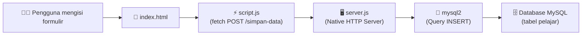

# Proyek Praktis: Formulir Biodata Pelajar (Pertemuan 4)

Mini project untuk mempelajari konsep **pengumpulan data melalui formulir HTML** dan **pengiriman data ke backend Node.js native HTTP server**, kemudian disimpan ke **database MySQL**.

Pada proyek ini, kalian akan membangun sebuah formulir biodata pelajar yang terdiri dari 8 field input. Data yang diisi oleh pengguna dikirim ke server menggunakan `fetch API`, diproses oleh server Node.js (tanpa Express), lalu disimpan ke tabel `pelajar` di database MySQL menggunakan library `mysql2`.

> [!NOTE]
> Proyek ini menggunakan **Node.js native HTTP module** — bukan Express. Tujuannya agar kalian memahami cara kerja server HTTP dari dasar sebelum menggunakan framework.

---

## 1. Persiapan Lingkungan

### a. Menyalakan MySQL Server

Pastikan MySQL server sudah berjalan di komputer kalian. Kalian bisa menggunakan salah satu dari:

- **XAMPP** — buka XAMPP Control Panel, lalu klik **Start** pada modul **MySQL**
- **DBngin** — buat instance MySQL baru dan jalankan
- **Laragon** — start All Services

### b. Membuat Database dan Tabel

Buka **phpMyAdmin** (http://localhost/phpmyadmin) atau MySQL client lainnya, lalu jalankan query SQL berikut:

```sql
CREATE DATABASE IF NOT EXISTS belajar;

USE belajar;

CREATE TABLE IF NOT EXISTS pelajar (
    id INT AUTO_INCREMENT PRIMARY KEY,
    name VARCHAR(100) NOT NULL,
    nama_sekolah VARCHAR(150) NOT NULL,
    email VARCHAR(100) NOT NULL,
    tanggal_lahir DATE NOT NULL,
    jumlah_saudara INT NOT NULL,
    jenis_kelamin VARCHAR(20) NOT NULL,
    kota_tempat_tinggal VARCHAR(100) NOT NULL,
    no_telp VARCHAR(20) NOT NULL
);
```

> [!IMPORTANT]
> Pastikan database `belajar` dan tabel `pelajar` sudah berhasil dibuat **sebelum** menjalankan server Node.js. Jika belum, server akan gagal terhubung ke database.

### c. Menginstall Dependency

Buka terminal di folder proyek ini, lalu jalankan:

```bash
npm install
```

Perintah di atas akan menginstall dependency `mysql2` yang tercantum di `package.json`.

---

## 2. Menjalankan Proyek

1. **Jalankan server** dengan perintah:

   ```bash
   node server.js
   ```

2. Jika berhasil, akan muncul pesan di terminal:

   ```
   Server berjalan di http://localhost:3000
   ```

3. **Buka browser** dan akses:

   ```
   http://localhost:3000
   ```

4. Formulir biodata pelajar akan tampil. Isi semua field, lalu klik tombol **Simpan**.

---

## 3. Struktur Folder Proyek

```
BiodataForms/
├── index.html      # Halaman formulir biodata (8 field input)
├── style.css       # Styling neumorphic card design
├── script.js       # Fetch POST ke endpoint /simpan-data
├── server.js       # Native Node.js HTTP server + koneksi mysql2
├── package.json    # Konfigurasi proyek & dependency (mysql2)
└── README.md       # Dokumentasi proyek (file ini)
```

> [!TIP]
> Struktur proyek ini sengaja dibuat **flat** (tanpa sub-folder) agar mudah dipahami. Semua file berada di satu level yang sama.

---

## 4. Alur Kerja Aplikasi

Berikut adalah alur data dari awal pengguna mengisi formulir hingga data tersimpan di database:



**Penjelasan alur:**

1. **Pengguna** membuka `http://localhost:3000` di browser → server mengirimkan file `index.html`
2. **Browser** merender halaman formulir beserta `style.css` dan `script.js`
3. **Pengguna** mengisi 8 field biodata dan menekan tombol **Simpan**
4. **`script.js`** mengambil semua nilai input, membungkusnya dalam objek JSON, lalu mengirim `fetch POST` ke endpoint `/simpan-data`
5. **`server.js`** menerima request, membaca body data menggunakan **stream** (`req.on('data')` dan `req.on('end')`), lalu mem-parse JSON
6. **`mysql2`** menjalankan query `INSERT INTO pelajar (...)` untuk menyimpan data ke database
7. **Server** mengirimkan response (berhasil/gagal) kembali ke browser

---

## 5. Endpoint API

| Method | Path           | Deskripsi                                          |
| ------ | -------------- | -------------------------------------------------- |
| `GET`  | `/`            | Menampilkan halaman formulir (`index.html`)         |
| `GET`  | `/style.css`   | Mengirim file stylesheet                           |
| `GET`  | `/script.js`   | Mengirim file JavaScript client                    |
| `POST` | `/simpan-data` | Menerima data biodata (JSON) dan menyimpan ke MySQL |

### Detail `POST /simpan-data`

**Request Body** (JSON):

```json
{
  "name": "Budi Santoso",
  "nama_sekolah": "SMKN 1 Bandung",
  "email": "budi@email.com",
  "tanggal_lahir": "2009-03-15",
  "jumlah_saudara": 2,
  "jenis_kelamin": "Laki-laki",
  "kota_tempat_tinggal": "Bandung",
  "no_telp": "081234567890"
}
```

**Response Sukses:**

```json
{
  "status": "berhasil",
  "message": "Data biodata berhasil disimpan!"
}
```

**Response Gagal:**

```json
{
  "status": "gagal",
  "message": "Terjadi kesalahan saat menyimpan data."
}
```

---

## 6. Panduan Langkah Praktik Siswa

### Tugas A — Persiapan Database

1. Buka XAMPP dan nyalakan MySQL
2. Buka phpMyAdmin di browser
3. Buat database `belajar` menggunakan query SQL yang tersedia di [Bagian 1b](#b-membuat-database-dan-tabel)
4. Pastikan tabel `pelajar` berhasil dibuat dengan **9 kolom** (termasuk `id` auto-increment)

### Tugas B — Membuat Formulir HTML (`index.html`)

1. Buat file `index.html` di folder proyek
2. Buat elemen `<form>` dengan **8 field input** sesuai kolom tabel:

   | No | Field                | Tipe Input     | `name` attribute       |
   | -- | -------------------- | -------------- | ---------------------- |
   | 1  | Nama Lengkap         | `text`         | `name`                 |
   | 2  | Nama Sekolah         | `text`         | `nama_sekolah`         |
   | 3  | Email                | `email`        | `email`                |
   | 4  | Tanggal Lahir        | `date`         | `tanggal_lahir`        |
   | 5  | Jumlah Saudara       | `number`       | `jumlah_saudara`       |
   | 6  | Jenis Kelamin        | `radio`        | `jenis_kelamin`        |
   | 7  | Kota Tempat Tinggal  | `text`         | `kota_tempat_tinggal`  |
   | 8  | No. Telepon          | `tel`          | `no_telp`              |

3. Tambahkan tombol **Simpan** dengan `type="button"` (bukan `submit`, karena kita menggunakan `fetch`)
4. Hubungkan file `style.css` dan `script.js` ke dalam HTML

### Tugas C — Styling Neumorphic (`style.css`)

1. Buat file `style.css`
2. Terapkan desain **neumorphic card** pada form:
   - Background warna soft (misalnya `#e0e5ec`)
   - Box-shadow ganda: satu terang (putih) dan satu gelap (abu-abu)
   - Border-radius pada card dan input field
   - Padding dan spacing yang nyaman

### Tugas D — Mengirim Data dengan Fetch API (`script.js`)

1. Buat file `script.js`
2. Ambil semua nilai input menggunakan `document.getElementById()` atau `document.querySelector()`
3. Bungkus data ke dalam objek JavaScript
4. Kirim data menggunakan `fetch()` dengan konfigurasi:

   ```js
   fetch('/simpan-data', {
     method: 'POST',
     headers: {
       'Content-Type': 'application/json'
     },
     body: JSON.stringify(dataBiodata)
   });
   ```

5. Tampilkan `alert()` untuk memberitahu pengguna apakah data berhasil disimpan atau tidak

### Tugas E — Membangun Server (`server.js`)

1. Buat file `server.js`
2. Import module `http` dan `fs` dari Node.js, serta `mysql2`
3. Buat koneksi ke database MySQL:

   ```js
   const mysql = require('mysql2');

   const db = mysql.createConnection({
     host: 'localhost',
     user: 'root',
     password: '', // sesuaikan dengan password MySQL kalian
     database: 'belajar'
   });
   ```

4. Buat HTTP server menggunakan `http.createServer()`
5. Tangani routing secara manual:
   - `GET /` → kirim `index.html`
   - `GET /style.css` → kirim `style.css`
   - `GET /script.js` → kirim `script.js`
   - `POST /simpan-data` → baca body request, parse JSON, lalu insert ke database
6. Untuk membaca body pada `POST` request, gunakan **stream**:

   ```js
   let body = '';
   req.on('data', (chunk) => {
     body += chunk;
   });
   req.on('end', () => {
     const data = JSON.parse(body);
     // ... lakukan INSERT ke database
   });
   ```

7. Jalankan server di port `3000`

### Tugas F — Pengujian

1. Jalankan `node server.js` di terminal
2. Buka `http://localhost:3000` di browser
3. Isi formulir dengan data lengkap, lalu klik **Simpan**
4. Periksa di phpMyAdmin apakah data sudah masuk ke tabel `pelajar`
5. Coba kirim data dengan field kosong — amati apa yang terjadi

---

## 7. Konsep Kunci yang Dipelajari

Setelah menyelesaikan proyek ini, kalian akan memahami konsep-konsep berikut:

- **ERD (Entity Relationship Diagram)** — memahami struktur tabel database dan relasi antar entitas. Tabel `pelajar` merupakan contoh sederhana dari sebuah entitas dengan 8 atribut
- **Native HTTP Server** — cara membuat server HTTP menggunakan modul bawaan Node.js (`http.createServer`) tanpa framework seperti Express, termasuk menangani routing secara manual
- **Stream Data pada Request Body** — cara membaca data yang dikirim oleh client melalui `req.on('data')` dan `req.on('end')`, karena data datang dalam bentuk stream (potongan-potongan kecil)
- **MySQL2 & Query Database** — menghubungkan Node.js ke MySQL menggunakan library `mysql2`, membuat koneksi, dan menjalankan query `INSERT INTO` untuk menyimpan data
- **Fetch API** — cara mengirim HTTP request dari sisi client (browser) ke server menggunakan `fetch()` dengan method `POST` dan body berformat JSON
- **Content-Type & MIME Types** — memahami pentingnya mengirimkan header `Content-Type` yang benar (seperti `text/html`, `text/css`, `application/json`) agar browser dan server dapat memproses data dengan tepat
- **Client-Server Architecture** — memahami pembagian peran antara frontend (HTML/CSS/JS di browser) dan backend (Node.js server + database)

> [!TIP]
> Setelah berhasil menyelesaikan proyek ini, tantang diri kalian untuk menambahkan fitur **tampilkan semua data** dengan endpoint `GET /data-pelajar` yang mengembalikan seluruh isi tabel `pelajar` dalam format JSON! 🚀
